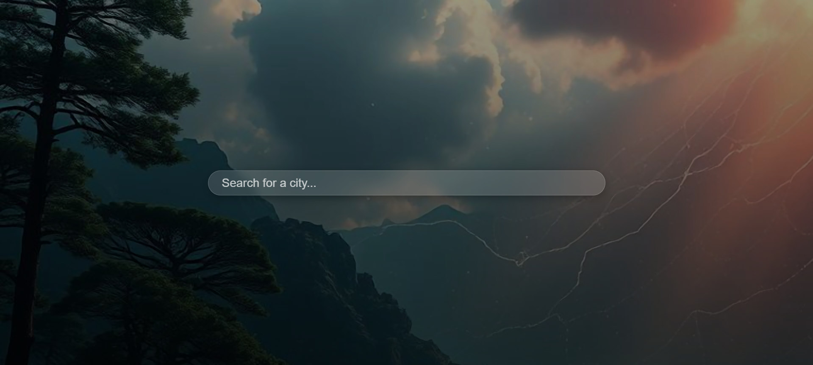
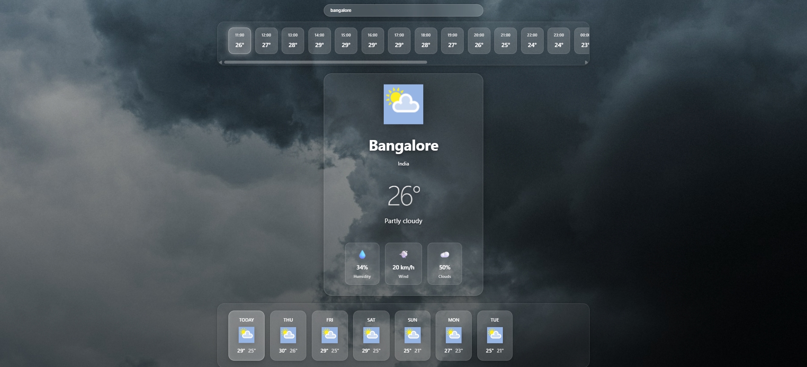

# Cinematic Weather Dashboard

[](https://react.dev)
[](https://vitejs.dev)
[](https://www.javascript.com)
[](https://weatherstack.com)
[](LICENSE)
[](https://weather-app-demo.vercel.app)

A modern, immersive weather application featuring a full-screen cinematic interface with glassmorphism design, dynamic backgrounds, and smooth animations. Built with React and Vite for exceptional performance and user experience.

---

## Screenshots

### Search Screen


### Weather Dashboard


---

## Features

### Visual Experience
- **Full-Screen Cinematic Layout** – Immersive weather dashboard that fills the entire viewport
- **Glassmorphism Design** – Modern frosted glass UI components with backdrop blur effects
- **Weather-Based Backgrounds** – Dynamic backgrounds that change based on conditions (sunny, rainy, cloudy, night, snowy)
- **Smooth Animations** – Staggered transitions, floating icons, and interactive hover effects
- **Responsive Design** – Optimized for desktop, tablet, and mobile devices

### Weather Functionality
- **Real-Time Weather Data** – Fetches current conditions from Weatherstack API
- **Current Weather Display** – Large temperature display with weather icon and description
- **Hourly Timeline** – 24-hour forecast with horizontal scrolling and current hour highlight
- **7-Day Forecast** – Weekly weather predictions with max/min temperatures
- **Weather Metrics** – Humidity, wind speed, and cloud coverage indicators
- **Error Handling** – Graceful error messages for invalid cities or API failures

### User Experience
- **City Search** – Intuitive search bar with Enter key support
- **Loading States** – Animated spinner during data fetching
- **No External UI Libraries** – Pure CSS with optimized animations
- **Smooth Transitions** – 0.3-0.8s easing functions for all interactions
- **Performance Optimized** – Efficient rendering and minimal repaints

---

## Tech Stack

- **Framework:** React 19.2.0
- **Build Tool:** Vite 7.3.1
- **Styling:** CSS3 (Glassmorphism, Animations, Responsive Grid)
- **API:** Weatherstack Free Tier
- **Language:** JavaScript (ES6+)
- **Package Manager:** npm
- **Version Control:** Git

---

## Installation

### Prerequisites
- Node.js 16+ and npm installed
- Weatherstack API key ([Sign up for free](https://weatherstack.com))

### Steps

1. **Clone the repository**
   ```bash
   git clone https://github.com/akshay-shastri/weather-app.git
   cd weather-app
   ```

2. **Install dependencies**
   ```bash
   npm install
   ```

3. **Set up environment variables**
   
   Create a `.env` file in the project root:
   ```env
   VITE_WEATHER_API_KEY=your_weatherstack_api_key_here
   ```
   
   > **Note:** Do not commit the `.env` file to version control. It is included in `.gitignore` by default.

4. **Start the development server**
   ```bash
   npm run dev
   ```
   
   Visit `http://localhost:5173` in your browser.

---

## Build & Deployment

### Local Build
```bash
npm run build
npm run preview
```

### Deploy on Vercel

1. Push your repository to GitHub
2. Visit [Vercel](https://vercel.com) and sign in
3. Click "Add New Project" and select your repository
4. In the project settings, add environment variables:
   - **Name:** `VITE_WEATHER_API_KEY`
   - **Value:** Your Weatherstack API key
5. Click "Deploy" – your app will be live in seconds

---

## Project Structure

```
weather-app/
├── src/
│   ├── components/
│   │   ├── SearchBar.jsx
│   │   ├── SearchBar.css
│   │   ├── CurrentWeather.jsx
│   │   ├── CurrentWeather.css
│   │   ├── HourlyTimeline.jsx
│   │   ├── HourlyTimeline.css
│   │   ├── ForecastStrip.jsx
│   │   └── ForecastStrip.css
│   ├── assets/
│   │   └── search-bg.jpg
│   ├── App.jsx
│   ├── App.css
│   ├── main.jsx
│   └── index.css
├── public/
├── .gitignore
├── package.json
├── vite.config.js
├── eslint.config.js
└── README.md
```

---

## Available Scripts

### Development
```bash
npm run dev
```
Starts the Vite development server with hot module reloading.

### Production Build
```bash
npm run build
```
Creates an optimized production bundle in the `dist` folder.

### Preview Build
```bash
npm run preview
```
Serves the production build locally for testing.

### Linting
```bash
npm run lint
```
Runs ESLint to check code quality and consistency.

---

## Usage

1. **Search for a City**
   - Enter a city name in the search bar
   - Press Enter to fetch weather data
   - Dashboard loads with smooth animations

2. **View Current Weather**
   - Large temperature display in the center
   - Weather icon and description
   - Humidity, wind speed, and cloud metrics

3. **Check Hourly Forecast**
   - Scroll horizontally through 24 hours
   - Current hour is highlighted with a glow effect
   - Hover effects on each hour card

4. **View Weekly Forecast**
   - Scroll through 7-day predictions
   - Today's card is highlighted
   - See max and min temperatures for each day

---

## Future Enhancements

- [ ] Dark mode toggle
- [ ] Geolocation-based weather
- [ ] Animated weather effects (rain, snow, clouds)
- [ ] Progressive Web App (PWA) support
- [ ] Celsius/Fahrenheit unit toggle
- [ ] Recent search history
- [ ] Extended 30-day forecast
- [ ] Weather alerts and notifications
- [ ] Interactive weather map
- [ ] Multiple location tracking

---

## Troubleshooting

**Issue:** "Invalid API key" error
- Verify your Weatherstack API key is correct
- Check that `.env` file contains `VITE_WEATHER_API_KEY`
- Restart development server after updating `.env`

**Issue:** App not loading
- Clear browser cache (Ctrl+Shift+Delete)
- Ensure Node.js version is 16 or higher: `node --version`
- Delete `node_modules` and reinstall: `npm install`

**Issue:** Styles not applying
- Clear browser cache and hard refresh (Ctrl+Shift+R)
- Restart development server

---

## License

This project is licensed under the MIT License – see [LICENSE](LICENSE) file for details.

---

## Author

**Akshay Shastri**  
GitHub: [@akshay-shastri](https://github.com/akshay-shastri)

---

## Acknowledgments

- [Weatherstack](https://weatherstack.com) – Reliable weather data API
- [Unsplash](https://unsplash.com) – Beautiful background images
- [React](https://react.dev) – JavaScript library for UI
- [Vite](https://vitejs.dev) – Next-generation build tool
